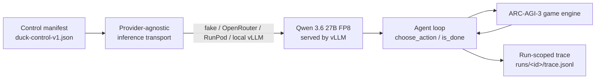

# solve-arc-agi-3

A custom agent harness for [ARC-AGI-3](https://three.arcprize.org), built around an
open-weight ~27-30B model, targeting Kaggle's ARC Prize 2026 submission constraints
(no internet at scoring, a wall-clock budget, GPU assigned by Kaggle).



One control manifest pins the model, vLLM flags, and agent contract; only the
transport underneath changes between a no-network fake server, a dev-only
OpenRouter check, and the pinned RunPod/Kaggle vLLM deployment. See
[`docs/baselines/qwen36-vllm-artifact.md`](docs/baselines/qwen36-vllm-artifact.md)
for exactly what each environment does and does not prove.

Planning artifacts (read these before making architectural changes):

- `docs/PLAN.md` — the agreed plan: problem, scope, requirements, shape.
- `docs/adr/` — the individual decisions and why.
- `docs/SLICES.md` — what's built vs. planned, one vertical increment at a time.
- `docs/QUESTIONS.md` — the full decision register.
- `docs/research/2026-09-20-current-state-and-strategy.md`: current research and competition strategy.
- `docs/research/arc-agi-3-solve-strategy.md`: historical August research snapshot.
- `docs/baselines/duck-control-v1.md`: pinned Duck control and clean-room boundary.

For how an agent should work in this repo, see [`AGENTS.md`](AGENTS.md).

## Commands

```sh
make install   # uv sync (dev group)
make test      # pytest
make lint      # ruff check + ruff format --check
make type      # mypy --strict over src
make check     # lint + type + test
make smoke     # deterministic OpenAI-compatible smoke; no GPU or network
```

The baseline operator commands and the boundary between fake, OpenRouter,
RunPod, and offline Kaggle evidence are documented in
[`docs/baselines/qwen36-vllm-artifact.md`](docs/baselines/qwen36-vllm-artifact.md).

## Status

The plan was revised on 2026-09-20 after the Milestone 1 Duck harness and newer
ARC-AGI-3 harness results became available. Slice V1 now reproduces the pinned
Duck/Qwen 3.6 27B FP8/vLLM baseline on Kaggle before adding a hybrid hypothesis
ledger and replay-verified executable world model. See `docs/SLICES.md`.

`notebooks/slice1_phase0_baseline.ipynb` and
`configs/model_configs.local.yaml` are superseded GGUF/Ollama prototypes retained
for history; ADR-0009 defines their replacement.

## Contributing

This is a personal ARC Prize 2026 entry, developed on a tight competition
schedule. Issues and forks are welcome; PRs are unlikely to be reviewed before
the submission deadlines in `docs/PLAN.md`.

## License

Apache License 2.0 — see [`LICENSE`](LICENSE). This project reimplements the
publicly documented behavior of the Duck harness as a pinned behavioral control;
see [`docs/adr/0011-duck-as-pinned-control-not-application-framework.md`](docs/adr/0011-duck-as-pinned-control-not-application-framework.md)
and [`docs/baselines/duck-control-v1.md`](docs/baselines/duck-control-v1.md) for
the clean-room boundary — no Duck source, prompts, or notebook cells are vendored
here.
