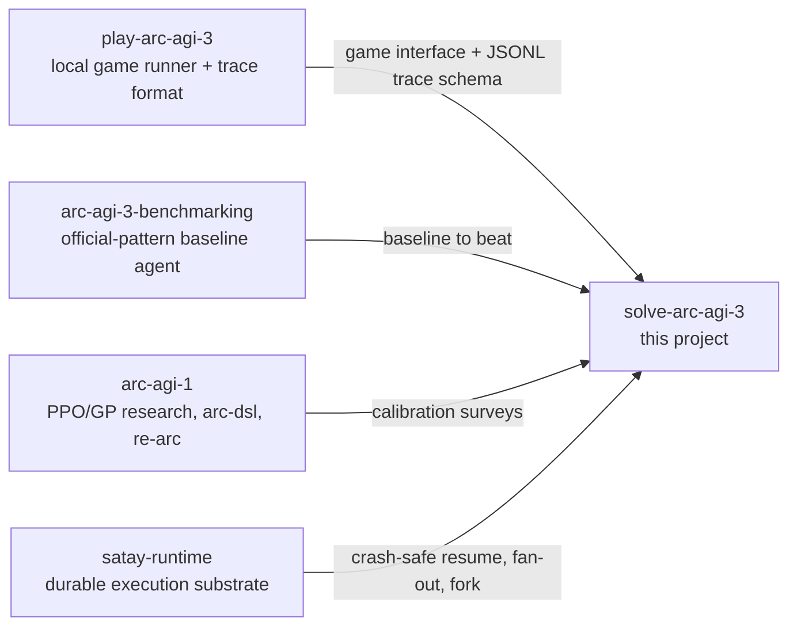
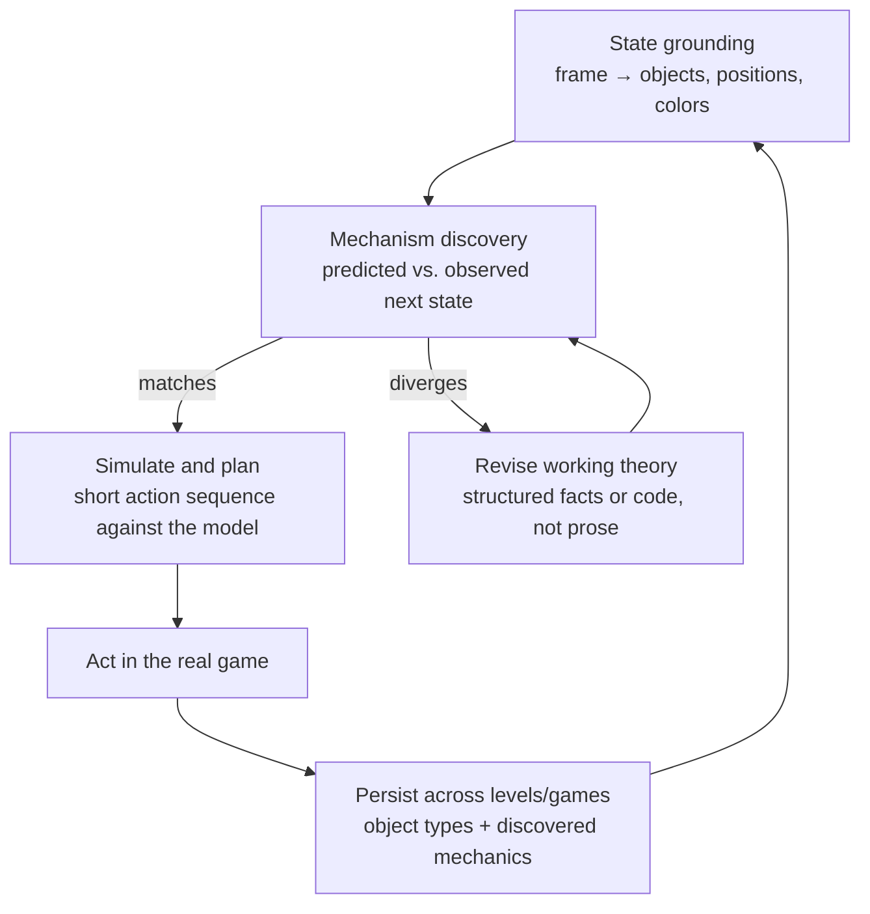
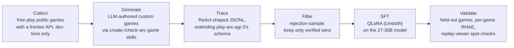
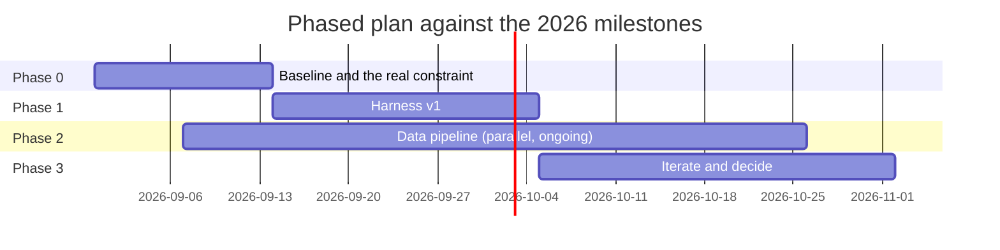

# Solving ARC-AGI-3 on a Kaggle budget

> Historical research snapshot compiled 2026-08-31. It contains superseded
> assumptions, including a 12-hour limit, RTX 6000 Ada/48GB hardware, the
> Qwen3-30B-A3B/GGUF runtime, and a required fine-tuning pipeline. The live
> research-backed direction is [PLAN.md](../PLAN.md), revised 2026-09-20; the
> build order is [SLICES.md](../SLICES.md). This file remains as provenance.

Compiled 2026-08-31. Where the ecosystem already stands, what NVIDIA and the
academic field have shown, and a concrete plan for a custom harness around a
27-30B open model, covering fine-tuning, synthetic data, agent memory, and the
workflow that ties them together.

Treat every score, GPU option, and date below against the live [ARC Prize
leaderboard](https://arcprize.org/leaderboard) and the [Kaggle rules
page](https://www.kaggle.com/competitions/arc-prize-2026-arc-agi-3/rules)
before acting on it. Competition details move.

**The constraints in one line:** no internet at scoring time, a wall-clock
budget under 12 hours, GPU options up to an RTX 6000 Ada at 48GB, scored on
RHAE (Relative Human Action Efficiency), with Milestone 2 on September 30 and
final submission on November 2, 2026.

## 1. What's already in place

Three sibling repos and one durable-execution runtime exist before this
project writes a line of code. None of them solve ARC-AGI-3, but together they
remove most of the plumbing a new harness would otherwise have to build from
zero.

| Repo | What it gives you |
| --- | --- |
| `play-arc-agi-3` | Runs real ARC-AGI-3 games locally via `arc_agi.Arcade`'s `NORMAL` mode: it downloads a game's source once, then every `reset()`/`step()` runs in-process at roughly 0.5ms per action, with no server round trip (ADR-0004). It also supports hand-authored custom games through `OFFLINE` mode (ADR-0002), which is the exact mechanism a synthetic-game pipeline would build on. It ships a versioned JSONL recording format already, one line per step, with a lean mode that skips frames since the games are provably deterministic (ADR-0003/0005). That's a ready-made trace format, not something to invent. |
| `arc-agi-3-benchmarking` | The official-pattern benchmarking harness: a growing text conversation, one model call per action, the frame rendered as a literal nested-list grid, JSON-envelope action parsing with a regex fallback, and token-based context trimming. It's a working but naive baseline. Every gap in it (no object model, no world model, no planning, memory is just raw chat history) is a concrete place a custom harness can improve. |
| `arc-agi-1` | A finished, separate project (PPO and genetic-programming agents over Michael Hodel's `arc-dsl` and `re-arc`) for the older static-grid benchmark. Its commissioned research surveys are useful calibration even though ARC-AGI-3 is a different, interactive problem. See the callouts below. |

### Can satay-runtime serve as the harness?

Satay is a local-first durable-execution runtime for async Python. It journals
every durable call to SQLite and replays a crashed workflow from the top,
reusing completed work. It declares "no agent abstraction" as a non-goal
outright (ADR-0025): five primitives and nothing else, no LLM provider
adapters, no prompt loop. So it won't write the harness for you. What it
plausibly earns its keep on:

**Good fit.**

- Crash-safe resume across a long Kaggle session. If the notebook stalls or
  errors mid-game, replay picks up exactly where it left off instead of
  losing completed levels.
- Fan-out through `map`/`gather` to try several candidate action sequences or
  game hypotheses as independently resumable branches, rather than hand-rolled
  bookkeeping.
- Fork-from-a-prefix to explore "what if step N had been different" cheaply,
  a natural fit under a world-model-and-plan style harness (section 3).
- A pure-Python core with near-zero third-party dependencies, the cheapest
  kind of dependency to vendor for a no-internet Kaggle run.

**Real friction.**

- The core is async-only, and a Kaggle ML stack (torch, generation loops) is
  normally sync and needs an executor or thread bridge.
- Fan-out is fail-fast by default. Pass `return_exceptions=True` when
  branching speculative sequences, or one dead-end branch aborts its
  siblings.
- It needs vendoring, not `pip install`, since Kaggle scoring has no
  internet. Straightforward given the dependency-light core, but worth
  testing early as a real packaging step.

**Verdict:** worth prototyping as the execution and checkpointing substrate
underneath a custom harness. It replaces the durable-execution layer, not the
agent layer. Expect to write the frame-parsing, prompting, world-model, and
action-selection logic yourself regardless.

## 2. What others are doing

The two most-cited ARC-AGI-3 results both depend on a frontier closed model
called through an API. That makes them informative for harness shape, not
directly portable to an offline 27-30B setup.

**NVIDIA AVO, 100% on the public set.** AVO ("Agentic Variation Operators") is
a general-purpose long-horizon agent architecture: memory persistence,
iterative inspect-plan-implement-evaluate loops, supervisory intervention, and
progress monitoring. NVIDIA built it first for evolutionary CUDA-kernel search
and then pointed it, unmodified, at ARC-AGI-3. Wrapped around Claude Opus 5
(which alone scores around 30%), it reached 100.00 RHAE across all 25
public-set environments (183 levels, 6,624 actions), edging out a competing
system, VISTA, which needed 7,542 actions. There's no public code, and it's
public-set only: the semi-private and private evaluation sets used for real
Kaggle scoring aren't touched by this result. The load-bearing part isn't the
model, it's the harness: iterate, remember, verify, keep going. That loop
shape is worth borrowing. The frontier API underneath it is not something a
Kaggle submission can use at scoring time.

**Executable world models, the closer analog.** Rodionov's *Executable World
Models for ARC-AGI-3* is the most directly transferable idea found. An agent
maintains an executable Python model of the game's objects and rules,
verifies it against observed transitions, refactors it toward simpler
abstractions, and plans by simulating through that model before acting, all
with the same prompt scaffold across every game and nothing game-specific
hard-coded. With GPT-5.5 on high reasoning it fully solved 15 of the games at
a mean RHAE of 58.12%; with GPT-5.4, 8 solves at 41.29%. Code isn't public
yet. This maps directly onto what the ARC-AGI-3 technical report itself calls
the benchmark's two core demands: state grounding (raw frames into objects,
variables, relations) and mechanism discovery (observed action effects into
executable rules). That's exactly the shape of the object-detection-as-reward
idea already on the table for this project (section 4).

> **Calibration, not a transferable recipe.** The 2024 ARC-AGI-1 Kaggle
> winners (MindsAI, "the ARChitects") won on test-time training: a per-task
> LoRA adapter fine-tuned at inference time on that task's own examples plus
> augmentations, about 51 seconds per task on one RTX 4090 in the reference
> implementation. The closer size precedent is NVIDIA's own NVARC team, who
> won ARC Prize 2025 on ARC-AGI-2 (24%) using synthetic data generation plus
> test-time training on a 4B-parameter model, evidence that the TTT recipe
> scales down to small open models and not just frontier-adjacent ones. But
> no equivalent recipe has been published for ARC-AGI-3 itself: there's no
> small set of labeled input/output pairs per "task" the way TTT needs, only
> an unfolding trajectory of frames, actions, and outcomes inside one
> session. Fine-tuning a LoRA adapter in-session on the trajectory itself is a
> plausible experiment, not a known technique. Budget it as R&D, not as a
> roadmap dependency.

## 3. Harness architecture

The benchmarking repo's existing loop (raw chat history, one action per call)
is the floor, not the target. The executable-world-model pattern is the
strongest published shape to build toward, and it decomposes into pieces that
don't require a frontier model to attempt, only a weaker execution of the
same idea.

1. **State grounding.** Turn each 64x64 frame into objects (connected
   components, colors, positions) rather than handing the model a raw nested
   list every turn. This is squarely the object-detection-and-tracking idea
   already on the table.
2. **Mechanism discovery.** After each action, compare predicted to observed
   next state. When they diverge, have the model revise its working theory
   of the game's rules, expressed as code or structured facts rather than
   prose buried in a chat transcript.
3. **Simulate before acting.** When the current world model is confident,
   plan a short action sequence against the simulated model instead of one
   call per real action. This is also the main lever for keeping LLM-call
   count within a fixed wall-clock budget on slower local inference.
4. **Persist across levels and games.** Carry object types and discovered
   mechanics forward instead of resetting to a blank conversation, which is
   where the memory design in section 6 plugs in.

A 27-30B open model will write and self-verify code less reliably than
GPT-5.5, so plan for a lighter-weight version of steps 2 and 3 first
(structured-fact tracking, not full code synthesis) and treat full
executable-code world-modeling as a stretch goal once the baseline loop works
end to end.

## 4. Fine-tuning, distillation, quantization

**Fine-tuning under Kaggle's actual VRAM.** Unsloth is the most practical
framework for QLoRA at this scale on constrained hardware. Gemma 3 27B QLoRA
reportedly fits under 22GB VRAM at about 1.6x the speed and 60% less memory
than a stock HF/PEFT+TRL stack. LLaMA-Factory can reuse Unsloth's kernels as a
backend and lands within roughly 6% of native speed with a more configurable
pipeline; Axolotl and torchtune are viable but slower or less turnkey for
QLoRA at 27-30B on a single GPU. A typical LoRA config targets rank 16-32,
alpha 32, across all linear layers (q/k/v/o plus the MLP gate/up/down
projections). One model-choice note: dense Qwen2.5-32B is tight even at
4-bit, while the Qwen3-30B-A3B MoE variant reportedly fits QLoRA in about
17.5GB, since only about 3B parameters are active per token. That lower
active-parameter count also helps the actual bottleneck below.

**Inference latency is the binding constraint, not VRAM.** An ARC-AGI-3 agent
needs one LLM call per game action, potentially many actions inside a
9-12 hour budget. GGUF/llama.cpp suits CPU/GPU-hybrid setups; AWQ/GPTQ via
vLLM or TensorRT-LLM are faster when the whole quantized model fits in VRAM.
At 4-bit, a 27-30B model's weights alone run 15-18GB, which is a thin margin
on a 24GB card once KV cache and context are added, but comfortable on the
RTX 6000's 48GB. No verified hardware-matched throughput numbers for 27-30B
on T4/P100/L4/RTX 6000 turned up in research. Past Kaggle LLM competitions do
offer a concrete precedent for the inference stack itself, if not the exact
numbers: the winning AIMO (AI Mathematical Olympiad) solution served its
model via TensorRT-LLM with FP8 plus speculative decoding (a combined ~2.7x
speedup over naive serving), and other competitive entries have run vLLM with
fp8 KV-cache, or a 32B model in 4-bit AWQ, specifically to fit Kaggle's
memory and speed envelope. Benchmark tokens per second on the actual target
instance before designing the harness's call budget, rather than assuming a
number from elsewhere transfers.

**Distilling from a frontier model.** The established recipe is
rejection-sampling plus SFT: generate many completions from a frontier
teacher, keep only the ones that verifiably succeeded, then SFT the 27-30B
student on those (this is how DeepSeek-R1's distilled line was built, off
about 600K rejection-sampled traces). The known failure mode specific to
agentic, multi-step distillation is exposure bias: the student never sees its
own mistakes during training, so small deviations compound at inference.
DAgger-style teacher-queries-on-student-states, on-policy distillation, and
SCoRe-style single-error correction are the documented mitigations, in
roughly increasing order of implementation effort. Because scoring has no
internet, all teacher trajectories have to be collected offline beforehand,
by running Claude, GPT, or Gemini against the public ARC-AGI-3 games, and
turned into training data before the Kaggle session starts.

## 5. Synthetic problems and reasoning traces

**Generating new games, not just new instances.** The official `arc-agi`
toolkit already supports editing and authoring games locally, which is
exactly what `play-arc-agi-3`'s `OFFLINE` mode wraps. A community repo,
`theredbluepill/arc-interactive`, has already built the pattern the "an LLM
writes new problems" hunch is reaching for: it packages `create-arc-game`,
`play-arc-game`, `check-arc-game-discoverable`, and `check-arc-game-solvable`
as agent skills, so an LLM authors a new game end to end and a separate check
mechanically validates that it's actually learnable and winnable before it's
added to a 249-plus-game collection. That's a community project, not
ARC-Prize-official, but it's directly forkable as a data-generation pipeline
sitting on top of `play-arc-agi-3`'s existing local-execution path. The same
generator-and-validator pairing shows up more generally in
procedural-content-generation-for-RL work (EnvGen, ChatPCG, adversarial
generator-vs-solver loops), none of it ARC-specific, but it confirms the
pattern is sound.

**A standardized trace format.** ReAct's thought-action-observation loop is
still the dominant schema for this kind of data. FireAct is the direct
precedent for the plan here: generate ReAct trajectories from a strong model,
keep only the ones that reached success, and SFT a smaller model on them.
That measurably outperforms a same-size prompting-only agent. The Agent Data
Protocol's `Trajectory{Action, Observation}` shape is a reasonable schema to
imitate, and `play-arc-agi-3`'s existing versioned JSONL recording format
(schema-versioned per line, already capturing frame, action, and state per
step) is close enough that the trace format should extend it rather than
invent a second one. Reuse the ADR-0003/0005 schema instead.

> **Open question, not settled fact.** Whether trace-level SFT actually beats
> SFT on outcomes alone is genuinely unresolved in the literature. One study
> found students can reach correct final answers while imitating internally
> wrong reasoning steps, meaning SFT can learn the trace's format more than
> its reasoning. No study addresses this for interactive, game-playing agents
> specifically. Plan to ablate it on this harness, not assume it.

**Where this bumps into the rules.** ARC Prize's own technical report
explicitly discourages this exact strategy for competition purposes: it
states the benchmark is designed to disqualify any agent trained on many
synthetically generated ARC-AGI-3 lookalike environments as benchmark-gaming.
That doesn't make synthetic pretraining data useless for building a capable
agent (it likely still teaches generalizable object and collision reasoning),
but it does mean such an agent may not be eligible or credited on the
official leaderboard. Treat synthetic games as a capability-building tool for
your own development loop, not a leaderboard shortcut.

## 6. Object-centric perception and agent memory

The closest structural analog to "object collisions as a reward signal" is
AXIOM (VERSES AI): it learns sprite identities and interaction dynamics from
about 100K frames of Atari-like games in minutes, using object state and
collision events as the substrate for both dynamics prediction and reward.
It isn't ARC-AGI-3-specific, but it confirms that the technical report's own
framing, state grounding and mechanism discovery, is the field's general
direction for exactly this kind of environment, not a one-off idea.

For persistent memory, Zep/Graphiti's temporal knowledge graph (ingesting
facts, tracking their validity over time, beating MemGPT on long-term
retrieval) is a plausible backbone for storing "discovered game mechanics" as
timestamped, updatable facts rather than replaying an ever-growing chat
transcript.

There's a confirmed data point here worth sitting with: *Graph-Based
Exploration for ARC-AGI-3* builds an explicit directed graph of
hash-identified states with action edges, with no LLM in the loop at all, and
solved a median of 30 out of 52 levels, ranking 3rd on the private
leaderboard and "substantially outperforming frontier LLM-based agents."
That's direct evidence, on this exact benchmark, that structured
state-and-transition memory can beat black-box LLM reasoning outright. It's a
strong argument for pairing a fine-tuned model with graph-structured memory
rather than leaning on chat-history context alone. No published work combines
object-centric perception, knowledge-graph memory, and an LLM policy on
ARC-AGI-3 in one system yet. That combination is open territory to claim, not
a gap in the reading.

## 7. Workflow

Today is 2026-08-31. Milestone 1 prize money already closed (June 30). The
two dates that matter now are Milestone 2 on September 30 and the final
submission on November 2 (results December 4). Call it four weeks to a first
real submission and roughly nine to the last one.

### Data, training, and validation loop

### Phased plan

**Phase 0, now through roughly two weeks.** Run `arc-agi-3-benchmarking` as-is
against the quantized 27-30B candidate and measure two numbers before
designing anything further: raw RHAE, and tokens per second on the actual
target GPU (T4x2, P100, or RTX 6000). Latency, not accuracy, is likely to be
the binding constraint. Confirm that before investing in a heavier harness.

**Phase 1, weeks two through five, targeting September 30.** Build harness
v1: state grounding plus a lightweight version of the executable-world-model
loop (structured facts before full code synthesis), driving the quantized
model directly with no fine-tuning yet. Wire satay-runtime underneath for
crash-safe resume and fan-out of candidate action branches. Submit something
working, even at modest RHAE.

**Phase 2, parallel and ongoing.** Build the data pipeline: frontier-model
free play plus LLM-authored custom games, filtered into ReAct-style traces,
then QLoRA SFT. Design the trace schema to already carry object and relation
fields, even before the memory system exists, so it doesn't need a migration
later.

**Phase 3, weeks five through nine, targeting November 2.** Ablate distilled
versus base versus world-model-loop-only on held-out games. Treat in-session
test-time adaptation and knowledge-graph memory as stretch experiments
layered on a working submission, not dependencies for one.

## 8. Open risks

- **No published TTT recipe for ARC-AGI-3.** The in-session adaptation idea
  is genuinely unproven. Budget it as research time, not a planned feature.
- **Latency compounds with call count.** A world-model-refactor loop that
  calls the LLM several times per real action may not fit the wall-clock
  budget on a slower local model the way it does behind a frontier API.
  Benchmark before committing to that shape.
- **Trace-SFT's benefit over outcome-only SFT is unverified** for this kind
  of task. Plan to ablate it rather than assume it.
- **Satay needs vendoring, not `pip install`,** for a no-internet scoring
  run. Confirm the packaging path early rather than late.
- **Milestone 1 has already closed.** The realistic targets are September 30
  and November 2, 2026.

## References

- NVIDIA, ["NVIDIA AVO Reaches 100% on ARC-AGI-3"](https://developer.nvidia.com/blog/nvidia-avo-reaches-100-on-arc-agi-3-demonstrating-a-frontier-level-general-purpose-architecture-for-long-horizon-autonomous-agents/) · [AVO: Agentic Variation Operators (arXiv 2603.24517)](https://arxiv.org/abs/2603.24517) · [VISTA project page](https://vista-research.github.io/)
- Rodionov, ["Executable World Models for ARC-AGI-3" (arXiv 2605.05138)](https://arxiv.org/abs/2605.05138) · follow-up [arXiv 2607.15439](https://arxiv.org/abs/2607.15439)
- ARC Prize, [ARC-AGI-3 Technical Report](https://arcprize.org/media/ARC_AGI_3_Technical_Report.pdf) · [2026 competition docs](https://docs.arcprize.org/arc-prize-2026) · [Kaggle: ARC Prize 2026, ARC-AGI-3](https://www.kaggle.com/competitions/arc-prize-2026-arc-agi-3) · [scoring methodology (RHAE)](https://docs.arcprize.org/methodology)
- ARC Prize 2024, [Technical Report](https://arxiv.org/html/2412.04604v1) · Akyürek et al., ["The Surprising Effectiveness of Test-Time Training"](https://ekinakyurek.github.io/papers/ttt.pdf) · the ARChitects, ["Boosting Performance on ARC is a Matter of Perspective"](https://arxiv.org/html/2505.07859)
- Unsloth, [Gemma 3 fine-tuning notes](https://unsloth.ai/blog/gemma3) · DeepSeek-AI, [DeepSeek-R1](https://huggingface.co/deepseek-ai/DeepSeek-R1) · [SCoRe: Reinforced Distillation of LLM Agents](https://arxiv.org/pdf/2509.14257) · [Structured Agent Distillation](https://arxiv.org/html/2505.13820v4)
- [theredbluepill/arc-interactive](https://github.com/theredbluepill/arc-interactive) (community game-authoring skills) · [ReAct](https://research.google/blog/react-synergizing-reasoning-and-acting-in-language-models/) · [FireAct](https://arxiv.org/pdf/2310.05915) · [AgentInstruct](https://huggingface.co/datasets/zai-org/AgentInstruct) · [Agent Data Protocol](https://arxiv.org/pdf/2510.24702) · ["Interpretable Traces, Unexpected Outcomes"](https://arxiv.org/pdf/2505.13792)
- [AXIOM (VERSES AI)](https://arxiv.org/pdf/2505.24784) · [Zep/Graphiti](https://arxiv.org/abs/2501.13956) · [MemGym](https://arxiv.org/pdf/2605.20833) · ["Graph-Based Exploration for ARC-AGI-3" (arXiv 2512.24156)](https://arxiv.org/pdf/2512.24156)
- NVIDIA, ["NVIDIA Kaggle Grandmasters Win AGI Competition"](https://developer.nvidia.com/blog/nvidia-kaggle-grandmasters-win-artificial-general-intelligence-competition/) (NVARC, ARC-AGI-2, 4B-model TTT) · [AIMO winning solution (TensorRT-LLM FP8 + speculative decoding)](https://blogs.nvidia.com/blog/reasoning-ai-math-olympiad/) · [QwQ-32B AWQ (AIMO early-sharing)](https://huggingface.co/MBMMurad/QwQ-32B-preview-AWQ-AIMO-earlysharing)

---

Compiled from three sibling repos already in this workspace (`play-arc-agi-3`,
`arc-agi-3-benchmarking`, `arc-agi-1`), a direct read of `satay-runtime`, and
external research current as of 2026-08-31. Also published as an
[Artifact](https://claude.ai/code/artifact/fac1219e-ec2b-4723-b85e-a96e529e045b)
for quick sharing; this file is the version to keep in sync going forward.
